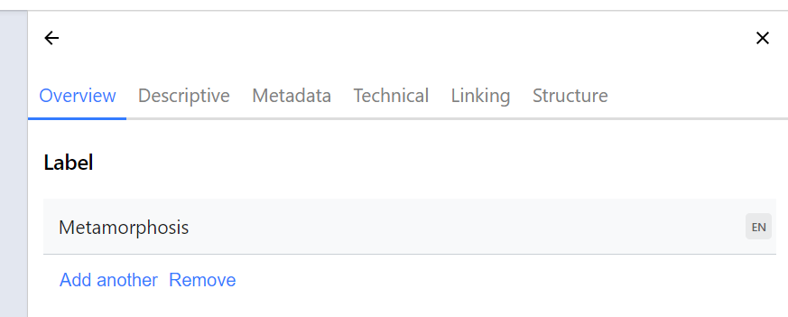
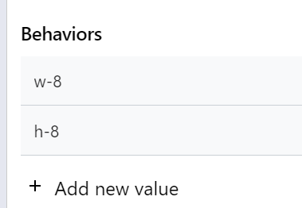
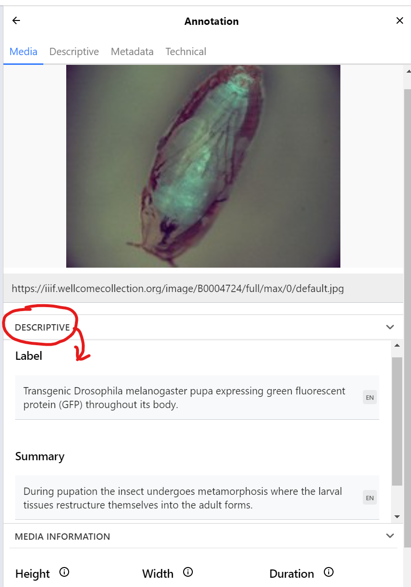
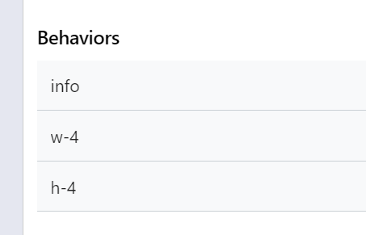

# Delft Exhibition Example

This exercise introduces the _Delft exhibition model._

Some existing examples:

 - [Novices](https://heritage.tudelft.nl/en/exhibitions/novieten)
 - [Corono Chronicles](https://heritage.tudelft.nl/en/exhibitions/corona-chronicles)
 - [Irrigation knowledge](https://heritage.tudelft.nl/en/exhibitions/irrigation-knowledge)

All of these examples show a set of common panel components, that can be used in various combinations, at different sizes, to build custom online exhibitions. These panels include:

 - Single image panels that pop out to a deep zoom viewer
 - Multi-image "collage" panels that pop out to a deep zoom viewer
 - Panels that pop out to launch a multi-step tour around a single image, or a collage of images, with different text for each step
 - Information panels that only contain text - and have longer text available as a pop-out
 - Panels that combine explanatory text with interactive elements
 - Video, 3D and 360-degree multimedia

And all of these can appear at different sizes and orientations relative to the other panels. The resulting layout is intended to echo the modular exhibition system used at TU Delft Library for physical exhibitions:

 - [Some background (2019 Medium article)](https://medium.com/digirati-ch/reaching-into-collections-to-tell-stories-3dc32a1772af)

In their online form, each exhibition is a web page - and that web page is driven by a single data file that carries all the information required to render the exhibition - the images, text, and other content.

This data file is a [IIIF Manifest](https://iiif.io/api/presentation/3.0/). Commonly, IIIF Manifests represent books, manuscripts, maps, paintings and other _digital objects_, and the IIIF manifest is loaded by a multipurpose IIIF Viewer (like the [Universal Viewer](https://universalviewer.io), or [Mirador](https://projectmirador.org)), which renders the digital object as a sequence of one or more views (e.g., allowing you to read through the pages of a book).

For Delft, the digital object that the Manifest represents is a Delft online exhibition, and the "viewer" is a bespoke web application that turns the information in the Manifest into the interactive exhibition on a single long form web page. You can still load these Delft exhibition manifests into a normal viewer and access the content, but won't get the specialised layout of the Delft exhibition.

## Why IIIF?

We could use a custom format to drive the Delft exhibitions (a custom JSON schema), and build a custom editing tool to assemble this custom format. But this would get very expensive to maintain. For organisations like Delft, much of the content of exhibitions already exists in IIIF form. If one panel is a painting, another panel is some pages from a book - these may already exist as IIIF Manifests, and we can import parts of those Manifests into our exhibition manifest.

We can use a IIIF Manifest Editor such as the Digirati Manifest Editor to build the Manifests that drive the exhibitions - this is a _general purpose tool_ for building IIIF Manifests visually.

Encoding the exhibitions in IIIF form is also good for archiving - for preserving the exhibition for future reference, and for re-use of its content. IIIF is an open standard designed for interoperability of content; exhibitions in a bespoke JSON format are much more likely to be forgotten and very unlikely to be reused.

## Modelling challenges

A Delft exhibition is more complex than a typical IIIF Manifest, in that there are specific layout requirements that a generic viewer would not be aware of (and unlikely to be able to render). The Delft exhibitions have  constructions like multi-step tours and info panels, and they have layout instructions that control the size of each panel. The IIIF model, when combined with W3C Web Annotations, gives us lots of flexibility in building up the structure of the Manifest. But for rendering the exhibition in the bespoke Delft "viewer", we have to follow a very specific structure in the IIIF - we need to control the _layout_ in the exhibition through the structure we build in the Manifest. Usually, we leave it to the IIIF Viewer (the UV, Mirador and so on) to decide on layout, but for Delft we want to control this layout precisely in the IIIF we create. It's OK for every other viewer to render this IIIF Manifest in its own way, but we need it to render in a very particular way when viewed _as a Delft exhibition_.

The IIIF Model gives us various components - like Lego bricks - that we can interpret as having a very specific intent when rendered _in the Delft exhibition._ This means that when using a general purpose tool like a IIIF Manifest Editor, we can't just pick any component we feel like to carry the content; we need to assemble it in exactly the way the Delft exhibition web application needs, to get the exact layout we want. This means we have to understand what the various IIIF components of a Delft exhibition do.

This exercise introduces the components to build a simple exhibition. It's not necessarily more complex than building any other IIIF Manifest with complex annotation content - it just needs to be done a particular way to work in the target environment.

Key concepts:

 - One exhibition is one Manifest - to build an exhibition like _Novices_, you create a single IIIF Manifest.
 - Each panel in the exhibition is an individual [IIIF Canvas](https://iiif.io/api/presentation/3.0/#53-canvas) within the single IIIF Manifest.
 - The exhibition renderer looks for custom [behavior](https://iiif.io/api/presentation/3.0/#behavior) properties to give information about size, orientation, and whether a panel is a text-only info panel.
 - Canvases can have multiple images on them, making a collage. In IIIF, the media is placed on the Canvas using a [painting annotation](https://iiif.io/api/presentation/3.0/#57-content-resources) (that is, an annotation with the `motivation` value of `painting`). In the Digirati Manifest Editor, media on the Canvas is listed on the **Structure** tab under the heading **Media**.
 - Individual painting annotations (media) can have `label` and `summary` values, which will be used (if present) by the exhibition. Many IIIF viewers would ignore those properties on a painting annotation.
 - Tour steps are constructed as a sequence of annotations with the `motivation` value of `describing`. All non-media annotations are listed on the **Structure** tab of the Canvas, under the heading **Annotations**.
 - A tour step can either _target_ (i.e., point at) one of the painting annotations (media) on the same Canvas, or it can target a _region_ of the Canvas. If the former, the exhibition will get the text for the tour step from that media - from the painting annotation's `label` and `summary` properties. If the latter, you need to provide an HTML body for the annotation (examples later).

## Building an example exhibition

For this exercise we will use some digitised material from Wellcome as sources.

First, open the [Manifest Editor](https://deploy-preview-239--manifest-editor-testing.netlify.app/). If you have previously used it, it may open on your last edited Manifest. 
Click the Manifest Editor logo in the top l;eft to get to the home screen, then click *Create Empty Manifest*. The Manifest Editor switched to editing a new Manifest.

You'll see the (as yet empty) Canvas List on the left. This contains a shortcut to "Edit Manifest" - that is, edit the properties of the Manifest itself.

In the right-hand panel, change the title of this new Manifest to "Metamorphosis", by editing its `label` property:



Now create the first Canvas. Click "Add Canvas" on the left hand panel and pick "Add an annotation from an image service" in the list of shortcuts that appears on the right.

Paste the following image service URl into the text box:

```
https://iiif.wellcomecollection.org/image/B0004724
```

This will create the canvas, and **fill it with a `painting` annotation** - you should see the pupa in the central panel.

Give the canvas the following label:

```
Transgenic Drosophila melanogaster pupa
```

<!-- Create thumbnail? -->

Now we add a couple of features that turn this into a Delf exhibition panel.

In the **Technical** tab on the left, add two `behavior` values: `w-8` and `h-8`. These will control this panel's layout in the exhibition. As they are _custom_ behaviors they don't exist in the **Built-in behaviors** section, so you'll need to add them manually with **Add new value**:



Although we have already given the canvas a label, we need a slightly richer description for when the user pops open this panel to look more closely at the image. This is done by setting `label` and `summary` properties on the `painting` annotation we created earlier.
While this is valid IIIF, it's not a common construction, so you'll need to click on the painting annotation itself - i.e., the first image entry under **Media** on the Canvas **Overview** tab. This allows you to add properties to the painting annotation.

Open up the **Descriptive** section and add the values:

#### label

```
Transgenic Drosophila melanogaster pupa expressing green fluorescent protein (GFP) throughout its body.
```
#### summary

```
During pupation the insect undergoes metamorphosis where the larval tissues restructure themselves into the adult forms.
```



If you now go back to the Overview (by pressing the back arrow at the head of the Right Hand panel) you'll see that the default label "Image with Image Service" has been replaced by the label you just gave it.
The benefits of this approach will become apparent later when you start having multiple painting annotations on the same Canvas - where there are multiple images under **Media**.


Now we will add a text panel, to serve as an introduction.

In the left hand Canvas list, you'll now see the first Canvas with its label. Click **Add Canvas** and this time click **HTML Annotation** from the list of templates.

Paste the following HTML into the **HTML Content** field and click "Create":

```html
<h2>Metamorphosis</h2>

<p>Metamorphosis is a biological process by which an animal physically develops including birth transformation or hatching, involving a conspicuous and relatively abrupt change in the animal's body structure through cell growth and differentiation. Some insects, fish, amphibians, mollusks, crustaceans, cnidarians, echinoderms, and tunicates undergo metamorphosis, which is often accompanied by a change of nutrition source or behavior.</p>
```

Give the canvas a height and width of 1000 on the Technical tab (these are the default values and will probably be already set).

The exhibition viewer doesn't use the `label` for an info Canvas, so just set it to something like `(info panel)` for convenience (the label is useful for identifying the canvas in the editor).

Now we need some custom behaviors to inform the Delft exhibition what this panel is. These are:

```
info
w-4
h-4
```




The last thing is to set the longer text that appears when the user clicks "Read more" on this panel in the exhibition. This text is not visible initially, and is carried as a descriptive annotation on the canvas (NOT a painting annotation like the one we have just made).

In the **Structure** tab on the right hand side, you can see an alternative view of the Canvas content. Under the **Media** heading is the `painting` annotation you already made, that will draw the text directly on the canvas.

Underneath this is the **Annotation** section that lets us edit the `annotations` property of the Canvas. In IIIF, we organise annotations into **Annotation Pages** - so we need to create one of these before we can add our text. Click **Add annotations** and then **Create** to create an annotation page.

Just underneath the message saying "No annotations", click **Create annotation**.

The action now switches to the canvas itself. This is because usually, you would be drawing a box on part of the Canvas to describe a particular region, but for this info panel we want to target the entire canvas. To do this we will make a normal annotation and then update its `target` to reference the entire canvas.


(todo)


